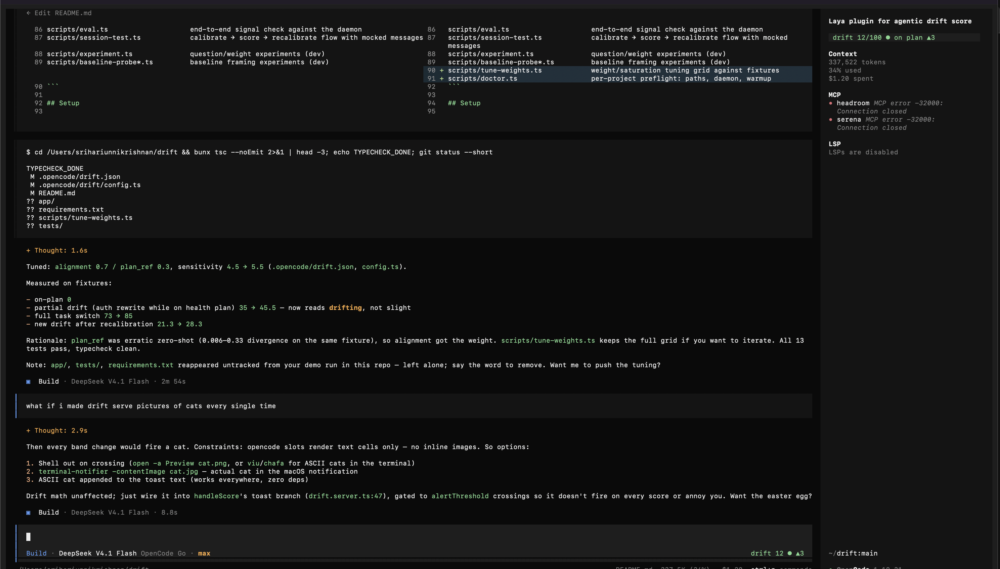

# laya-drift


Semantic drift monitor for opencode sessions. It embeds the session state with
[Laya](https://huggingface.co/convaiinnovations/laya) — a non-autoregressive
decision model that returns **calibrated probability distributions** for typed
questions in a single forward pass — and measures how far the running context
has moved from the calibrated plan.

- `/calibrate` captures the plan (argument or derived from the session) and sets
  the drift baseline.
- Every user prompt and every finished turn re-embeds the running context and
  recomputes drift. Tool calls inside a turn do not rescore.
- The live score renders as a pill in the session sidebar (`sidebar_content`) and
  as a compact badge next to the prompt (`session_prompt_right`). Color rule:
  scores **below 50 are green, 50 and above are red** (`scoreColor` in
  `drift.tui.tsx`).
  Toasts still announce band changes and threshold crossings.
- `/recalibrate` re-anchors: the previous anchor plus new context becomes the
  new baseline, and drift resets to zero.

## How the score works

Laya is used purely as a semantic proxy. A probe of two typed questions
(`.opencode/drift/questions.ts`) is answered against the session state:

| question | type | weight |
| --- | --- | --- |
| `alignment` (on_plan / expanding / off_plan) | choice | 0.75 |
| `plan_ref` (doing_the_plan / doing_more / doing_other) | choice | 0.25 |

`plan_ref` is down-weighted because its zero-shot answers are unstable; the
`alignment` probe carries most of the signal. The weights are a starting point,
not the result of benchmark evaluation — tune them in `drift.json`.

Each answer is a calibrated probability distribution. The baseline is built at
calibration time from the **current state digest** — the same `PLAN` +
`RECENT ACTIVITY` structure used for scoring — so drift is measured from the
moment of calibration onward. If the session has no activity yet, the baseline
uses a canonical "the work follows the plan" exemplar instead (plan-alone
states answer structurally different questions on the base checkpoints).

That is also why `/recalibrate` resets to zero and stays there: the previous
anchor plus the new context become the new anchor, and the state at that moment
becomes the zero point. Only divergence that happens *after* recalibration
raises the score.

If calibration happens before any work (fresh session), the monitor anchors on
the **first substantive activity** instead: the first turn scores 0 and drift is
measured from there. Calibration chatter — `/calibrate` prompts, any turn that
called a drift tool, and status replies — is excluded from the digest entirely,
so it can never register as drift. State is per opencode session; a new session
starts uncalibrated.

Every score compares the current vector to the baseline with Jensen-Shannon
divergence, takes the weighted mean, and maps it through a saturating curve:

```
drift = 100 · (1 - e^( -sensitivity · Σ wᵢ · JS(baselineᵢ, currentᵢ) / Σ wᵢ ))
```

Bands: `<20` on-plan, `<40` slight, `<65` drifting, `≥65` off-plan. Above
`display.injectSystemAbove` the score is also injected into the system prompt so
the agent can self-correct.

### SDM v2 risk score (shipped)

Alongside the drift score, every turn computes a **failure-risk score** (0–100)
from seven probes answered in the same Laya pass:

- five paraphrases of the alignment/plan_ref constructs, compared against a
  fixed reference window (first substantive turns) with Jensen-Shannon
  divergence;
- the **answer-flip** rate — how often the probe's answer changes vs the window;
- two calibrated `noul` probes ("has the activity left the plan?") and their
  shift from the window;
- the three signals are standardized with corpus-calibrated constants and
  accumulated as an e-process (betting on the standardized mean).

It is a **ranking signal, not a probability**: use it to spot sessions at risk
of failing, not as a calibrated alarm. The offline evaluation
(`experiments/deepswe/README.md`, `analysis/sdm.md`, literature review in
`experiments/deepswe/literature.md`) measured on 12 mixed-outcome runs:

| signal | failure-prediction AUC |
| --- | --- |
| shipped single-probe drift score | 0.563 |
| SDM `js` (probability distance) | 0.594 |
| SDM `noul` shift | 0.688 |
| SDM `flip` (answer change) | 0.859 |
| **SDM combined (shipped risk score)** | **0.906** |
| execution-evidence baseline (non-semantic) | 0.969 |

Reading the risk score: `risk` appears in `/drift` output, in the sidebar pill
once it passes 40, and in toasts; `risk.warnAbove`/`risk.alertAbove` control
the thresholds. On the same corpus, a calibrated *departure alarm* remains
weak (0–1 of 3 injected departures detected) because hard-task exploration
overlaps the signal — the risk score is meant for ranking, the drift score for
the live band display.

## Layout

```
opencode.json                      project config (plugins auto-load from .opencode/plugins)
.opencode/
  drift.json                       tunables (weights, thresholds, daemon, stateDir)
  tui.json                         registers the live-score TUI plugin
  package.json                     JS deps for the plugins (bun installed by opencode)
  command/{calibrate,recalibrate,drift}.md
  plugins/drift.server.ts          server plugin: tools, hooks, scoring, toasts
  plugins/drift.tui.tsx            TUI plugin: live score pill/badge + /drift-graph chart
  drift/                           shared core (questions, embedding, divergence, digest, store, graph)
src/driftd.py                      Laya HTTP daemon (model resident)
```

## Setup

```bash
cd /Users/srihariunnikrishnan/drift
bash scripts/setup.sh              # .venv (reuses system torch) + pip install laya
(cd .opencode && bun install)      # or npm install
```

The venv uses `--system-site-packages`, so the existing torch/transformers
install is reused instead of downloading another copy.

First run downloads the checkpoint (`multilingual`, ~650 MB). To warm it up
manually:

```bash
.venv/bin/python src/driftd.py --port 8765 --checkpoint multilingual
```

The server plugin autostarts the daemon on first calibration if it is not
already listening, and reports progress in the toast/log.

Then, inside this project:

```bash
opencode
/calibrate Build the CSV importer with the schema in docs/plan.md
...work...
/recalibrate We intentionally moved to the streaming rewrite
/drift
```

## Configuration

`.opencode/drift.json` is read by both plugins:

- `daemon`: `port`, `checkpoint` (`english` 512 ctx / `multilingual` 1024 ctx /
  `typed-decisions`), `device`, `python`, `autostart`, `startTimeoutMs`.
- `scoring`: `sensitivity` (how fast divergence saturates 100), `minIntervalMs`
  (scoring throttle), `digestChars` (context window sent to Laya), `weights`.
- `display`: `toastMode` (`changes` | `always` | `off`), `warnThreshold`,
  `alertThreshold`, `injectSystemAbove` (set `null` to disable system
  injection).
- `risk`: `enabled`, `warnAbove` / `alertAbove` (risk-score thresholds for the
  pill and toasts), `betting` (e-process betting rate), `alpha` (evidence level
  at which the e-process would alarm).
- `stateDir`: where per-session state is written for the TUI to read
  (default `~/.local/share/laya-drift`).

## Testing

```bash
bunx tsc --noEmit   # typecheck plugins
pytest tests/test_js_drift_early_detection.py   # offline metric checks (live run is opt-in)
```

### DeepSWE drift experiment

`scripts/deepswe/` runs real [DeepSWE](https://github.com/datacurve-ai/deep-swe)
tasks with `deepseek-v4.1-flash` through the OpenCode inference API while the
real drift pipeline scores every turn, and grades the result with the
benchmark's own `grader.py`:

```bash
bun scripts/deepswe/run.ts prepare    # clone pinned repos, build envs, validate grading vs solution
bun scripts/deepswe/run.ts run --arms control,distractor,guided,oracle --rollouts 1
bun scripts/deepswe/analyze.ts        # metrics + parameter fit → experiments/deepswe/analysis/report.md
```

First pilot (3 tasks, 21 runs): at the shipped heuristic (weights 0.75/0.25,
sensitivity 7, threshold 35) the score caught 4/6 injected off-plan switches
with a 1-turn median latency, but also alarmed on 11/15 non-drifted runs — hard
long-horizon exploration and even successful reference-patch runs can read as
drift. The fitted grid (alignment 0.65 / plan_ref 0.35, sensitivity 2, threshold
35) cuts false alarms to 2/15 at the cost of detection (2/6). Outcome prediction
from early drift is weak. Follow-ups in the same write-up: objective-contribution
probes are near-constant zero-shot (AUC 0.500); a closed-loop self-correction
prompt fired 4 times and recovered 0 runs; an evidence-triggered verification
nudge was understood but not acted on; and observable execution evidence
separates the corpus (AUC 0.951) because none of the 27 failing runs ever ran the
test suite. Forcing the verifier into the loop then showed the agent never edits
a file within a 12–20 turn budget at all. The constructive result comes from a
local-verifier micro-benchmark built on the same repos: with runnable tests and
mixed outcomes, evidence-based stall detection catches every eventual failure
7–9 turns early (AUC 0.969) while JS divergence is at chance (0.563) — so the
monitor is useful as an evidence-first stall detector, not as a semantic drift
detector. A literature-driven redesign of the semantic side (SDM v2: paraphrase
ensemble + `noul` + answer-flip signals + window baseline + e-process alarm)
then lifted its failure-prediction AUC from 0.563 to 0.906 — useful as a risk
ranker, still not as a departure alarm. Full write-up with plots, per-run
trajectories and the parameter grids:
[`experiments/deepswe/README.md`](experiments/deepswe/README.md).

## Honest limits

- Laya ships over-confident, and its base checkpoints are weak zero-shot on
  custom typed questions. The two shipped probes are a heuristic choice; the
  score is a relative signal, not a calibrated probability of failure. The
  DeepSWE pilot (`experiments/deepswe/analysis/report.md`) measures the
  false-alarm cost of that heuristic and the parameters the grid would pick
  instead.
- The SDM v2 risk score is a **ranking signal validated on 12 mixed-outcome
  runs** (AUC 0.906 vs 0.563 for the shipped score); it is not a calibrated
  probability, its calibration constants come from that small corpus, and as a
  departure alarm it is insensitive. See `experiments/deepswe/README.md`.
- The English checkpoint has a 512-token context (`multilingual` gets 1024);
  the digest keeps only the anchor plus the newest activity that fits. Long
  autonomous runs can push relevant older context out of the window.
- The `multilingual` checkpoint is the default because of the larger context
  and 2.2× faster inference; switch `daemon.checkpoint` to `english` for a
  better English-only encoder (the daemon downloads only the requested
  checkpoint).
- Scoring runs locally and adds ~50–300 ms per update on Apple Silicon (MPS).
  Set `scoring.minIntervalMs` higher if that matters.
