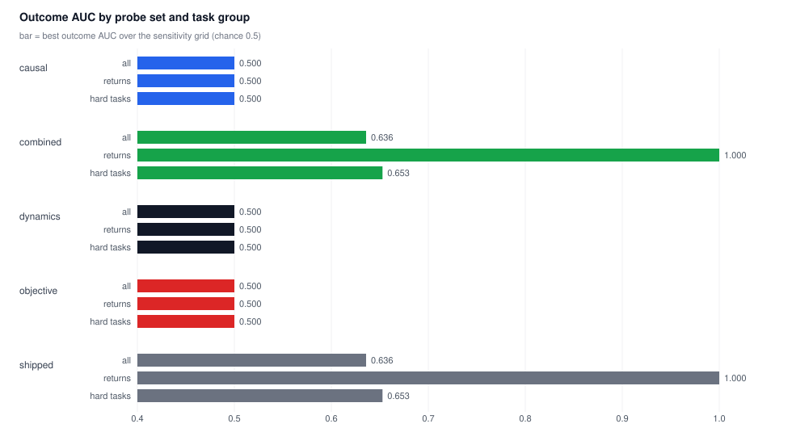
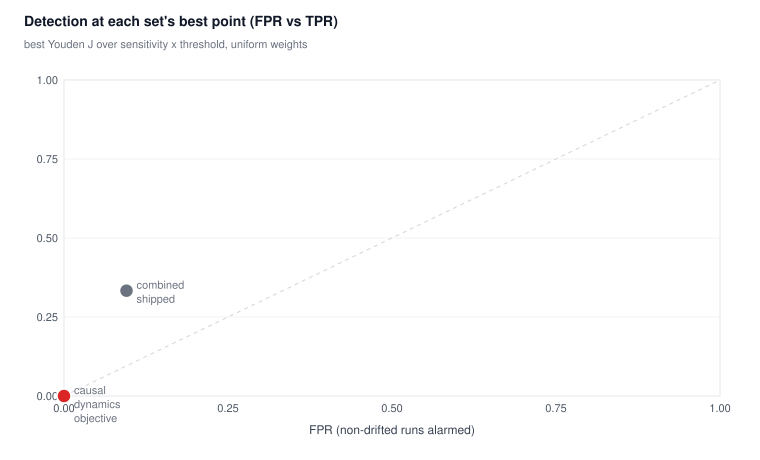
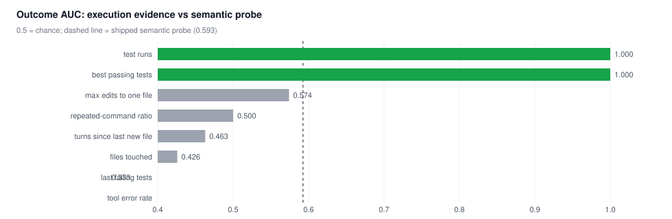
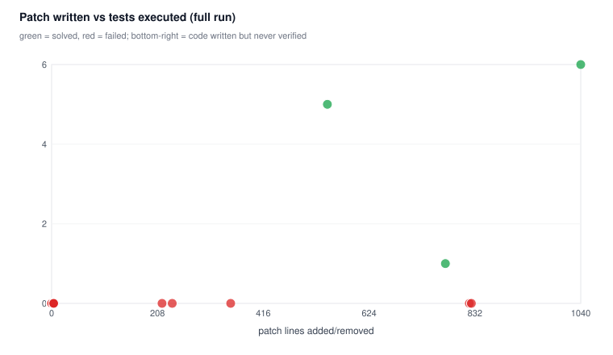
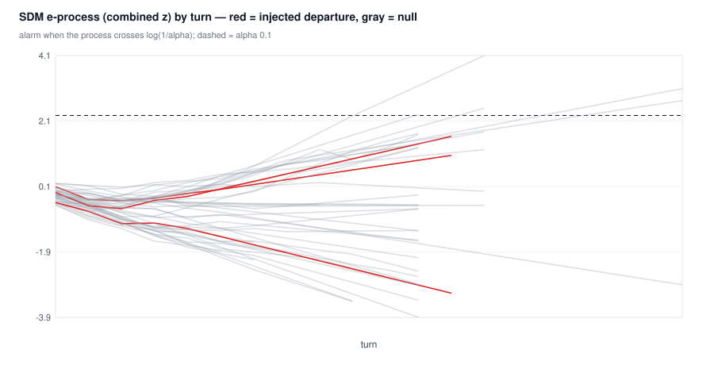
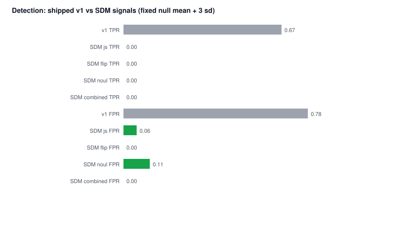

# DeepSWE drift early-detection experiment

Does the Jensen-Shannon drift score catch an agent leaving the plan *early*,
on real long-horizon tasks, with a real model? This directory holds the
harness, the raw logs, the plots and the parameter fits for that question.

- **Benchmark:** [datacurve/deep-swe](https://github.com/datacurve-ai/deep-swe) — real tasks from pinned open-source repositories, graded by the benchmark's own `grader.py` against held-out tests
- **Model:** `deepseek-v4.1-flash` through the [OpenCode inference API](https://opencode.ai/v2/docs/console/inference/) (`OPENCODE_KEY` from `.env`)
- **Scorer:** the plugin's real pipeline — Laya probes (`alignment`, `plan_ref`), Jensen-Shannon divergence, the same `computeDrift` curve
- **Sample:** 36 DeepSWE runs plus 12 local-verifier mutant runs across the same 3 repositories, 12–20 turn budgets, one 4-tool agent loop (bash/read/write/edit); 30 have full transcripts and are re-probed offline with alternative question sets

## TL;DR

| | detection (injected off-plan switch) | false alarms (non-drifted runs) | outcome AUC |
| --- | --- | --- | --- |
| shipped heuristic (w 0.75/0.25, k=7, τ=35) | 4/6, median 1 turn | 18/24 | 0.62 |
| fitted for detection (w 0.65/0.35, k=2, τ=35) | 2/6, median 1 turn | 2/24 | 0.61 |

The score reacts to an off-plan user message within one turn, but on these
tasks it also fires during ordinary hard-task exploration and even on runs that
end up solving the task. Detection and false alarms trade off on a poor curve;
the parameter grid is in [`analysis/params.json`](analysis/params.json).

Follow-ups: replacing the probes with objective-contribution questions did not
improve specificity — those answers are near-constant zero-shot (AUC 0.500), so
the bottleneck is probe grounding, not question wording. A closed-loop
self-correction prompt fired 4 times and recovered 0 times, and an
evidence-triggered verification nudge was understood but not acted on. Observable
execution evidence does separate the corpus (AUC 0.951 combined) — because none
of the 27 failing runs ever executed the test suite. A forced verifier in the
loop then showed the deeper problem: the agent never reaches implementation at
all within budget. The local-verifier micro-benchmark at the end is where the
monitor finally shows usefulness: evidence-based stall detection reaches AUC
0.969 while semantic drift is at chance (0.563). Details below.

## Protocol

```
task instruction ──▶ agent loop (12 turns max, tools: bash/read/write/edit)
                          │  after every turn: digest (PLAN + RECENT ACTIVITY)
                          │  → Laya probe → vector → JS divergence vs baseline
                          ▼
                    final workspace ──▶ benchmark grader.py ──▶ reward / f2p / p2p
```

Arms, one rollout per arm/task unless noted:

| arm | prompt | purpose |
| --- | --- | --- |
| `control` | task instruction | natural success/failure |
| `distractor` | task instruction, then an off-plan "new priority" user message injected after turn 3 | known drift onset → detection latency |
| `guided` | instruction + reference outline (files/symbols) | stronger but still failing baseline |
| `oracle` | instruction + `reference.patch` to apply | plan-following success control |

Fresh-session semantics match the plugin: a session with no activity at
calibration time anchors on its first substantive turn, and that turn scores 0.
Every turn logs its raw probe vector, so the analysis can re-score any run under
any weights/sensitivity without re-running the model or the daemon.

### Metrics

- **TPR / FPR** — fraction of distractor runs whose score crosses the threshold *after* injection, vs fraction of non-drifted runs (control/guided/oracle) that cross it at any point.
- **Latency** — turns from injection to first crossing.
- **Outcome AUC** — does the max score over the first 80% of turns separate runs that end with `reward=0` from runs that end with `reward=1`?
- **Spearman** — rank correlation between early max drift and the final fail-to-pass fraction.

## Results

### Per-run drift trajectories


Scores climb in every arm. `returns` separates cleanly (oracle flat at ~2, all
failing runs ≤ 32); `mashumaro` and `sqlfmt` do not — the successful oracle run
there reaches 46–70, inside the failing band.

### Per-arm summary


Mean max drift: control 56.0, guided 54.0, distractor 47.2, oracle 39.9. The
ordering is right, the overlap is large. Mean fail-to-pass: oracle 1.00, every
other arm 0.00.

### Every scored turn


The `warn 35` line runs through the middle of all four distributions: at the
shipped threshold the monitor is alarming on roughly half of all turns,
including oracle turns.

### Early drift vs final progress


Green (solved) runs span 3–70 early drift; failing runs span 5–82. The
correlation is slightly *negative* (Spearman −0.22) — driven by the two tasks
where the reference-patch run itself looks like drift.

### Threshold sweep (default weights, k=7)


TPR falls below FPR past τ≈15 and never recovers; median latency is pinned at 1
turn wherever detection happens. Raising τ suppresses both curves together.

### Detection tradeoff over the full grid


Every candidate from the grid (alignment 0.50–1.00 step 0.05 × sensitivity
1–15 × threshold 5–80). The fitted point (red) buys FPR 0.13 by giving up
detection; the default (black) sits above it in false alarms. No candidate gets
near the top-left corner.

### Outcome AUC grid


Outcome prediction is flat across the grid (0.64–0.69) — weights and sensitivity
barely move it. The parameter fit below is therefore about alarm behaviour, not
failure prediction.

## Fitted parameters

From [`analysis/params.json`](analysis/params.json) (grid objective: Youden
J = TPR − FPR, tie-break on median latency):

| objective | alignment | plan_ref | sensitivity | threshold | TPR | FPR | outcome AUC |
| --- | --- | --- | --- | --- | --- | --- | --- |
| shipped | 0.75 | 0.25 | 7 | 35 | 0.67 | 0.75 | 0.62 |
| detection (J) | 0.65 | 0.35 | 2 | 35 | 0.33 | 0.08 | 0.61 |
| outcome (AUC) | 0.55 | 0.45 | 1.5 | — | — | — | 0.64 |

Reading: the data does not justify changing the shipped weights. A lower
sensitivity (k≈2) plus the same threshold is the best false-alarm reduction on
this sample, but it also loses two of six detections, and outcome prediction
does not improve. Treat the fitted row as the shape of the tradeoff, not a new
default.

## Follow-up: objective-grounded probes

The first pass is task-dependent: `returns` separates solved from unsolved
almost perfectly, the other two tasks do not separate at all. Hypothesis: the
shipped probes measure *similarity to the initial state*, which conflates
exploration with drift, so they should be replaced by questions about the
*contribution* of the recent activity to the objective.

The same 30 logged trajectories (transcripts rebuilt turn-by-turn, digests match
100%) were re-scored offline through Laya with four probe families, uniform
weights per set — the model never re-ran, only the questions changed:

| set | questions | median max divergence | outcome AUC (all) | returns | hard tasks |
| --- | --- | --- | --- | --- | --- |
| shipped | alignment, plan_ref | 0.216 | 0.636 | 1.000 | 0.653 |
| objective | objective_support, progress | 0.032 | 0.500 | 0.500 | 0.500 |
| causal | causal_link, plan_consistency | 0.142 | 0.500 | 0.500 | 0.500 |
| dynamics | stuck, evidence | 0.080 | 0.500 | 0.500 | 0.500 |
| combined | all eight | 0.239 | 0.636 | 1.000 | 0.653 |





Result: the contribution probes are **degenerate zero-shot on this checkpoint**.
`objective_support` and `progress` move by 0.03 JS divergence across an entire
run — near-constant distributions, so they carry no ranking signal (AUC 0.500
exactly, no threshold in the grid detects anything). `plan_consistency` moves
more (0.142 median max) but not in a direction that separates solved from
unsolved. Adding all four families to the shipped pair reproduces the shipped
numbers exactly: the extra questions contribute nothing.

Interpretation: the bottleneck is not only *which* question is asked — on this
model the answers to contribution questions are not grounded at all. Making the
monitor objective-aware needs probe calibration/fine-tuning, few-shot
elicitation, or non-probe evidence (files touched, tests run, plan steps
resolved) rather than zero-shot paraphrases. Full grid and per-question
validation: [`analysis/probe-comparison.md`](analysis/probe-comparison.md),
[`analysis/probe-validation.json`](analysis/probe-validation.json).

## Follow-up: execution evidence

Direction C from the probe result: stop trusting only the probe's
interpretation and read observable work products. Offline features were
extracted from the same 30 transcripts — files touched (including
bash-mediated `git apply` / `sed -i` / redirects), test runs, passing and
failing counts, repeated commands, tool errors, turns since a new file — and
compared against the final reward over the first 80% of turns.





| feature | direction | outcome AUC |
| --- | --- | --- |
| test runs | lower = failure | 1.000 |
| best passing tests | lower = failure | 1.000 |
| max edits to one file | higher = failure | 0.574 |
| repeated-command ratio | higher = failure | 0.500 |
| turns since last new file | higher = failure | 0.463 |
| files touched | lower = failure | 0.426 |
| last failing tests | higher = failure | 0.333 |
| tool error rate | higher = failure | 0.049 |

What the data actually says:

- **No failing run executed the test suite at all** — 0 test runs in the full
  run for all 27, including runs that produced up to 825 line patches. Every
  solved run ran the tests 1–6 times and saw them pass.
- Structured-tool file tracking alone missed the oracle runs entirely (they edit
  via `git apply` in bash), so evidence extraction needs action normalization.
- Tool error rate is inverted (0.049): running tests produces tracebacks, so
  error text tracks verification activity, not failure.
- No run wrote a test file at all (0/30) — the only passing tests in the corpus
  are the oracle runs applying the reference patch.
- The pre-registered combined evidence score reaches AUC 0.951 vs the semantic
  probe's 0.593, but the test feature is entangled with the success mechanism
  (only the oracle arm applies the reference patch). Read it as "the failing
  runs never verified", not as an independent predictor.

Actionable implication: the useful recovery signal is the missing objective step
("you wrote code and never ran the verifier"), not baseline similarity.

## Closed-loop intervention

New arm `intervene`: when the score crosses a trigger threshold, the monitor
injects a self-correction user message (max 2 per run, 3-turn cooldown).

| trigger | runs | interventions | recovered (score < 35 within 3 turns) | mean reward |
| --- | --- | --- | --- | --- |
| alert 65 | 3 | 0 — never crossed | — | 0.00 |
| warn 35 | 3 | 4 (mashumaro 2, sqlfmt 2) | 0/4 | 0.00 |

The loop closes mechanically, but the self-correction message did **not** bring
the trajectory back: mean drift before the notice was 52.4 → 75.4 after
(mashumaro) and 35.4 → 55.1 (sqlfmt). `returns` never triggered (drift stayed
below 9), consistent with its clean separation. Control-arm mean reward is also
0.00, so no outcome difference is measurable at this sample size.

### Intervention v2: evidence-triggered (`verify` arm)

v1 asked "are you drifting?" — the wrong signal and the wrong recovery target.
v2 triggers on execution evidence instead, with two stages:

1. files edited but no tests after 4 turns → "run the verifier, fix failures, name the next objective step"
2. no edits and no tests after 6 turns → "state the next objective step, then do it: make the change or run the verifier"

Recovery target is objective satisfaction — tests executed, first green test,
final reward — not return to baseline.

| runs | nudges | ran tests after nudge | first green test | reward | score "recovered" |
| --- | --- | --- | --- | --- | --- |
| 3 | 5 (all stage 2) | 0/3 | never | 0.00 | 1/5 |

Two things happened, and the split matters:

- **Verbal compliance worked.** Both inspected runs replied with a concrete next
  objective step ("implement `returns/validated.py` …", "create the feature
  branch and study the builder's field packing …") and then kept exploring with
  bash/read — no edits, no tests, to the end of the budget.
- **Behavior did not change.** Files touched and test runs stayed at zero after
  every nudge. The one run where the *score* dropped back below threshold did no
  objective work at all — a clean example of why score recovery is the wrong
  target.

Interpretation: comprehension is not the bottleneck. At this model and turn
budget the agent is still in an exploration phase when nudged, and neither
verification instructions nor objective reconstruction move it into
implementation. Either the nudge needs to arrive later (after the agent has
something to verify), or the missing piece is a policy/scaffold change, not a
monitor message.

### Scaffold: verifier in the loop (`scaffold` arm)

If failing runs never verify, remove the agent's choice: after any turn where
files changed, the harness runs the repository's own test suite and feeds the
output back as a user message (the held-out tests are never used as feedback).
A fallback run fires at turn 8 if the agent never edits. Two budgets were
tested: 12 turns (r1) and 20 turns (r2).

| runs | budgets | auto-verifier runs | edits by end | tests by end | first green | reward |
| --- | --- | --- | --- | --- | --- | --- |
| 6 | 12 and 20 turns | 6 | 0 files | 0 tests | turn 1 / 8 | 0.00 |


- Every run received a green repository suite before doing any work
  (mashumaro 29,884 passed; sqlfmt 1,226; returns 61) and never broke it.
- No scaffold run edited a file — not by turn 12, not by turn 20. The forced
  verifier had nothing to verify.
- The repository suite cannot observe progress on the new behavior: DeepSWE
  holds the feature tests out, so a local verifier can only catch regressions,
  and only if the agent writes code.
- Combined with 0/30 runs ever writing a test file, there is no mid-run
  objective signal available on these tasks unless the agent authors one.

Interpretation: verifier-in-the-loop is vacuous before implementation, and the
real blocker sits one level up — the agent's exploration/implementation policy.

## Micro-benchmark: local verifiers, mixed outcomes

The DeepSWE pilot could not show usefulness: every non-oracle run failed, no run
ever verified, and the only successes were reference-patch applications. To test
the monitor where progress is actually measurable, six **mutants** were built
from the same tasks: apply each reference solution and its tests, then inject a
small regression into a solution line (validated so some tests fail and some
still pass). The agent now sees a runnable failing test suite, a real bug and a
per-turn pass fraction; grading is the same visible suite.

12 runs (control and stall arms, one per mutant): 8 solved, 4 failed.


| feature (first 80% of turns) | direction | outcome AUC |
| --- | --- | --- |
| files touched | lower = failure | 1.000 |
| max turns without test progress | higher = failure | 0.969 |
| passing-test gain | lower = failure | 0.750 |
| test runs | lower = failure | 0.688 |
| early max drift (semantic) | higher = failure | 0.563 |

What this shows:

- **The failing runs never acted.** Both sqlfmt failures sat at their initial
  pass count (67/79, 78/79) for the entire run — zero edits, zero progress —
  while every successful run edited and fixed the regression.
- **The stall signal is a near-perfect early warning.** "No new passing test for
  3 turns" detects both failures at turn 5, 7–9 turns before the run ends
  (AUC 0.969, 100% recall), but fires on 3 of 5 eventual successes (60%
  precision on this sample).
- **Semantic drift is at chance here (0.563).** JS divergence does not separate
  solved from failed runs even when the outcome is a one-line regression fix.
- **The nudge did not rescue stalled runs.** Success rate is 4/6 in both arms;
  after two nudges the failing sqlfmt runs made zero progress.

**Usefulness conclusion.** On a benchmark where the agent can verify its own
work, an evidence-based stall monitor is genuinely useful: it flags every
eventual failure many turns early, and it does so without the semantic layer,
which is uninformative. Its current form over-alarms on slow-but-recovering runs
and its message alone does not change behavior, so the honest use is detection
and reporting first — tighten precision (e.g. require an edit attempt with no
test delta) before wiring it to interventions.

## Follow-up: SDM v2 — calibrated semantic monitor (detection only)

Scope: keep Laya's concepts (typed questions, calibrated distributions, one
forward pass) and make the *semantic* monitor useful without building an
intervention. Design choices are sourced from the literature review in
[`literature.md`](literature.md):

- **paraphrase-ensemble probes** — 5 choice questions (3× alignment, 2× plan_ref)
  plus 2 `noul` questions in one Laya pass (self-consistency, semantic entropy)
- **reference-window baseline** — mean divergence over the first 3 turns
  (ADWIN/CUSUM-style window comparison)
- **decision-flip signal** — fraction of probes whose answer changed vs the
  window majority (a categorical, less noisy signal than probability distance)
- **`noul` shift** — Laya's calibrated boolean primitive as a second family
- **per-question standardization on null runs**, then an **e-process alarm** at
  `1/α` (SAVI; the object-tracking failure-detector recipe, arXiv:2602.12983)

42 runs re-scored offline (30 DeepSWE + 12 mutants).

### Failure prediction on the mutant corpus — the win

| signal | early-max AUC |
| --- | --- |
| SDM `js` (probability distance) | 0.594 |
| SDM `noul` (calibrated boolean shift) | 0.688 |
| SDM `flip` (answer change) | 0.859 |
| SDM `combined` (standardized mean) | **0.906** |
| shipped v1 (single probes) | 0.563 |
| execution evidence (non-semantic baseline) | 0.969 |

The redesign more than doubles the semantic monitor's failure discrimination
(0.563 → 0.906), and the strongest single semantic signal is the *answer flip*,
not the probability distance. It remains short of the execution-evidence
baseline, which needs no semantics at all.

### Injected plan-departure detection — still hard

| monitor | TPR | FPR | median delay |
| --- | --- | --- | --- |
| shipped v1 (τ=35) | 0.67 (2/3) | 0.78 (14/18) | 1.0 |
| SDM combined, fixed null+3 sd | 0.00 (0/3) | 0.00 (0/18) | n/a |
| SDM e-process, α=0.1 | 0.00 (0/3) | 0.17 (3/18) | n/a |
| SDM e-process, α=0.2 | 0.33 (1/3) | 0.22 (4/18) | 10.0 |

Signals do move after injection (sqlfmt `flip` 0.4 → 0.8; mashumaro `js`
0.035 → 0.103), but the null population — hard-task exploration — overlaps
them, so calibrated thresholds stay silent. Same task-dependence as the
original pilot, now with a statistical reason: Laya's answers on these digests
are near-uniform (confidence 0.06–0.25), so the effect size is small relative to
null variance. The e-process still gives a principled false-alarm knob (null ARL
≈ 13 turns at α=0.1) but recall is limited.





### Verdict

SDM v2 is useful as a **failure-risk ranker**, not as a departure alarm. It is
the first semantic configuration that clearly beats the shipped monitor
(0.906 vs 0.563) and it needs no intervention: rank live sessions by the
combined z-score and review the top ones. As an alarm it is precise but
insensitive on this corpus; closing that gap needs better probe grounding, not
a better threshold — exactly what the objective-probe experiment showed.

## Findings

1. **It reacts fast.** When the user asks for off-plan work, the score moves within one turn — the probe reads the prompt itself.
2. **It is not specific on long-horizon tasks.** Exploration, test runs and patch application all read as drift; successful runs in two of three tasks crossed the warn threshold.
3. **Threshold is the dominant knob, not weights.** Sweeping τ moves both TPR and FPR together; the weight/sensitivity grid changes little (outcome AUC flat).
4. **Task matters more than parameters.** `returns` separated solved from unsolved almost perfectly; `mashumaro` and `sqlfmt` did not separate at all.
5. **For early *failure* warning this pilot is weak** (AUC 0.62, n=36, 3 solved runs). More rollouts and easier tasks are needed before trusting the curve.
6. **Better questions alone did not fix specificity.** Objective/contribution probes are near-constant zero-shot on this checkpoint (AUC 0.500); the bottleneck is probe grounding, not question wording.
7. **A self-correction prompt did not reduce measured drift.** 0/4 interventions recovered; mean score rose after the notice in both tasks where it fired.
8. **The failing runs never verified their work.** Zero of 27 failing runs executed the test suite; all three solved runs did, repeatedly. Observable execution evidence separates this corpus better than any semantic probe, but needs action normalization and must not be confused with the success mechanism itself.
9. **Intervention v2: the agent understands the nudge but does not act on it.** Evidence-triggered nudges produced verbal next-step restatements in 2/2 inspected runs, but 0/3 runs ran any test afterwards; score recovery without objective progress appeared once. Comprehension is not the bottleneck — timing or policy is.
10. **Forcing verification changed nothing, because nothing gets built.** Six scaffold runs with automatic verifier feedback and 12–20 turn budgets produced zero edits and zero test runs. The bottleneck is the agent's exploration policy, not the monitor.
11. **On a local-verifier micro-benchmark, the monitor is useful as a stall detector, not a semantic one.** With runnable tests and mixed outcomes, "no new passing test for 3 turns" reaches AUC 0.969 with 100% recall (7–9 turns of lead), while JS divergence is at chance (0.563). Failing runs never edited; the stall nudge did not rescue them.
12. **The semantic monitor can be made useful — as a risk ranker.** Redesigning it on Laya's concepts (paraphrase ensemble + `noul` + answer-flip + window baseline + standardization + e-process) lifts failure-prediction AUC from 0.563 to **0.906** on the mutant corpus; the answer-flip signal alone reaches 0.859. As a calibrated departure *alarm* it stays insensitive (0–1 of 3 injections) because exploration overlaps the signal, but the e-process supplies a principled false-alarm knob (ARL ≈ 13 turns at α=0.1).

## Diagnosis

Two independent failures, not one:

1. **Measurement** — JS divergence reliably says "something changed", not
   "something harmful changed". It reacts to an off-plan prompt within one turn,
   but specificity is task-dependent and no weight / sensitivity / threshold /
   probe paraphrase fixes it; the contribution probes are not grounded by this
   checkpoint at all.
2. **Intervention** — even when the alarm fires, "you are drifting" is not an
   actionable recovery signal: 0/4 recoveries, drift rose after the notice; the
   evidence-triggered nudge was understood but not acted on; forced verification
   had nothing to verify because no run ever edited a file within budget.
3. **Agent policy** — at this model and scaffold, 12–20 turns is all
   exploration. No monitor signal can compensate for a policy that never
   reaches implementation.

4. **Semantic drift, as implemented, is not the useful signal.** In the
   micro-benchmark where outcomes are mixed and progress is measurable,
   evidence-based stall detection is a strong early warning (AUC 0.969) and JS
   divergence is at chance (0.563).

The useful form of this monitor is therefore **evidence-first for alarms,
semantics for ranking**: compare the trajectory against an objective-grounded
representation of task progress (passing tests, edits, verified steps) when a
stall alarm is needed, and use the redesigned semantic signal (SDM v2, AUC 0.906)
to rank sessions by failure risk. Recovery still means returning to satisfying
the original objective, not returning to behaving like turn 1; and the
intervention half needs its own experiment, because the stall message alone did
not rescue a single stalled run.

## Limits

- n=36 across 3 Python tasks; per-arm n is 3–6, and the offline re-probing covers the 30 runs with transcripts. Confidence intervals are wide.
- Runs use local clones and local Python envs instead of the benchmark's Docker images, so absolute pass rates are not comparable to the DeepSWE leaderboard. The grader, held-out tests and repositories are the benchmark's own.
- Only the distractor arm has a ground-truth drift onset; the natural-failure analysis rests on 27 failing and 3 succeeding runs.
- Laya's probes are a heuristic; absolute scores are relative signals.

## Reproduce

```bash
bun scripts/deepswe/run.ts prepare     # clone pinned repos, build envs, validate grading vs solution
bun scripts/deepswe/run.ts run --arms control,distractor,guided,oracle --rollouts 2 --max-turns 12 --inject-at 3
bun scripts/deepswe/analyze.ts         # metrics, parameter fit, plots
bun scripts/deepswe/reprobe.ts         # offline re-scoring with alternative probe sets
bun scripts/deepswe/compare-probes.ts  # probe-set comparison
bun scripts/deepswe/evidence.ts        # observable execution-evidence features
bun scripts/deepswe/run.ts run --arms scaffold --max-turns 20 --verify-after 8   # verifier in the loop

bun scripts/deepswe/prepare-mutants.ts        # local-verifier micro-benchmark (reference solution + tests + injected regression)
bun scripts/deepswe/run.ts run --manifest mutants --arms control,stall
bun scripts/deepswe/analyze-mutants.ts        # early-warning AUC + stall-detector precision

bun scripts/deepswe/sdm.ts                    # SDM v2: paraphrase ensemble + noul + flip + e-process (detection only)
```

Offline checks (no network/daemon): `bun scripts/deepswe/selftest.ts`, or
`pytest tests/test_js_drift_early_detection.py`. The live pytest path is opt-in:
`DEEPSWE_RUN=1 pytest tests/test_js_drift_early_detection.py`.

## Files

```
scripts/deepswe/
  tasks.json      task manifest (repo, commit, env, held-out test commands, distractor)
  run.ts          prepare / run / grade commands
  probes.ts       candidate probe sets (shipped, objective, causal, dynamics, combined)
  reprobe.ts      offline re-scoring of logged transcripts + fixture validation
  compare-probes.ts  probe-set comparison report and plots
  execution-evidence.ts  shared tool-use evidence (tests, bash-mediated edits)
  evidence.ts     observable execution-evidence features from transcripts
  prepare-mutants.ts  builds the local-verifier micro-benchmark
  analyze-mutants.ts  early-warning + stall-detector analysis for mutants
  mutants.json    mutant task manifest (generated by prepare-mutants)
  sdm.ts          Semantic Drift Monitor v2 (detection only)
  literature.md   arXiv review behind the SDM design
  metrics.ts      pure metric + parameter-fit functions
  plots.ts        dependency-free SVG plots
  analyze.ts      CLI: metrics + fit + report.md + plots
  selftest.ts     offline metric checks
experiments/deepswe/
  runs/<runID>/run.json       per-turn scores, per-question divergences, probe vectors, baseline, interventions
  runs/<runID>/transcript.jsonl  model conversation (tool calls + outputs)
  runs/<runID>/reprobe.json   probe vectors for every candidate set (offline re-scoring)
  runs/<runID>/model.patch    submitted diff
  runs/index.jsonl            one summary line per run
  analysis/report.md          generated report
  analysis/params.json        default/fitted stats, top grid rows
  analysis/probe-comparison.md  probe-set comparison
  analysis/probe-validation.json  fixture ordering per probe
  analysis/evidence.md        execution-evidence feature report
  analysis/evidence-features.json  per-run features
  analysis/plots/scaffold-objective-vs-drift.svg  forced verifier vs drift
  analysis/plots/*.svg        the figures above
```
