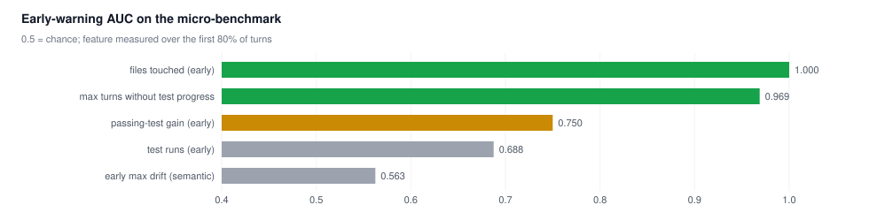
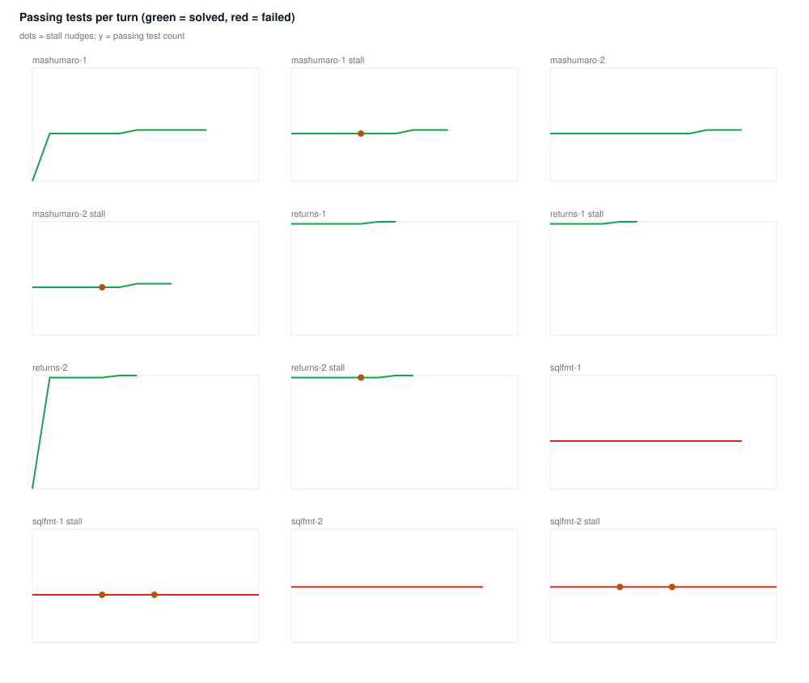

# Local-verifier micro-benchmark (mutants)

Generated 2026-09-23T09:54:11.985Z · 12 runs · reference tests visible and runnable

## Outcomes

| arm | runs | solved | stall nudges |
| --- | --- | --- | --- |
| control | 6 | 4/6 | 0 |
| stall | 6 | 4/6 | 7 |

| run | arm | reward | f2p | turns | early max drift | max stall (turns) | stall alarm | nudges | progress after nudge |
| --- | --- | --- | --- | --- | --- | --- | --- | --- | --- |
| mutant-mashumaro-1__control__r1 | control | 1 | 72/72 | 11 | 26.8 | 4 | 5 | - | - |
| mutant-mashumaro-1__stall__r1 | stall | 1 | 72/72 | 10 | 13.8 | 6 | 5 | 5 | 5 |
| mutant-mashumaro-2__control__r1 | control | 1 | 72/72 | 12 | 25.9 | 8 | 5 | - | - |
| mutant-mashumaro-2__stall__r1 | stall | 1 | 72/72 | 9 | 18.2 | 5 | 5 | 5 | 5 |
| mutant-returns-1__control__r1 | control | 1 | 159/159 | 7 | 7.4 | 4 | 5 | - | - |
| mutant-returns-1__stall__r1 | stall | 1 | 159/159 | 6 | 14.4 | 3 | - | - | - |
| mutant-returns-2__control__r1 | control | 1 | 159/159 | 7 | 53.1 | 3 | 5 | - | - |
| mutant-returns-2__stall__r1 | stall | 1 | 159/159 | 8 | 13.9 | 5 | 5 | 5 | 3 |
| mutant-sqlfmt-1__control__r1 | control | 0 | 67/79 | 12 | 11.6 | 8 | 5 | - | - |
| mutant-sqlfmt-1__stall__r1 | stall | 0 | 67/79 | 14 | 25.3 | 10 | 5 | 5,8 | 0 |
| mutant-sqlfmt-2__control__r1 | control | 0 | 78/79 | 12 | 28.6 | 8 | 5 | - | - |
| mutant-sqlfmt-2__stall__r1 | stall | 0 | 78/79 | 14 | 20.6 | 10 | 5 | 5,8 | 0 |

## Early-warning signal quality (failure = reward 0)

| feature | direction | outcome AUC |
| --- | --- | --- |
| early max drift (semantic) | higher = failure | 0.563 |
| max turns without test progress | higher = failure | 0.969 |
| passing-test gain (early) | lower = failure | 0.750 |
| test runs (early) | lower = failure | 0.688 |
| files touched (early) | lower = failure | 1.000 |

Stall rule (3 turns without a new passing test, from turn 5) on the stall arm: 5/6 runs alarmed, 2 true, 3 false, 0 missed.

