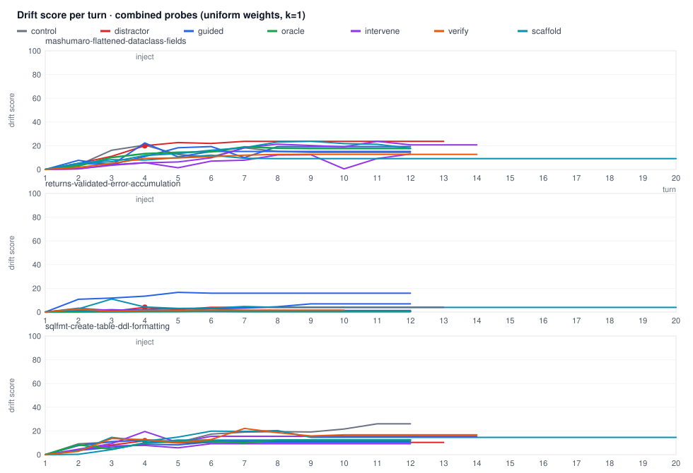

# Probe-set comparison (same trajectories, different questions)

Generated 2026-09-23T07:00:40.051Z · 30 re-probed runs (transcripts rebuilt, digest match 100%) · uniform weights per set

| set | questions | median max divergence | outcome AUC (all) | outcome AUC (returns) | outcome AUC (hard) | best detection (k, t) | TPR | FPR | latency | TPR@7/35 | FPR@7/35 |
| --- | --- | --- | --- | --- | --- | --- | --- | --- | --- | --- | --- |
| causal | causal_link, plan_consistency | 0.142 | 0.500 (k=0.5) | 0.500 | 0.500 | 0.5, 5 | 0.00 | 0.00 | n/a | 0.00 | 0.00 |
| combined | alignment, plan_ref, objective_support, progress, causal_link, plan_consistency, stuck, evidence | 0.239 | 0.636 (k=1) | 1.000 | 0.653 | 2, 40 | 0.33 | 0.10 | 1.0 | 0.67 | 0.81 |
| dynamics | stuck, evidence | 0.080 | 0.500 (k=0.5) | 0.500 | 0.500 | 0.5, 5 | 0.00 | 0.00 | n/a | 0.00 | 0.00 |
| objective | objective_support, progress | 0.032 | 0.500 (k=0.5) | 0.500 | 0.500 | 0.5, 5 | 0.00 | 0.00 | n/a | 0.00 | 0.00 |
| shipped | alignment, plan_ref | 0.216 | 0.636 (k=1) | 1.000 | 0.653 | 2, 40 | 0.33 | 0.10 | 1.0 | 0.67 | 0.81 |

Best overall set: **combined** (AUC 0.636 at k=1). Same trajectories under that probe set:

