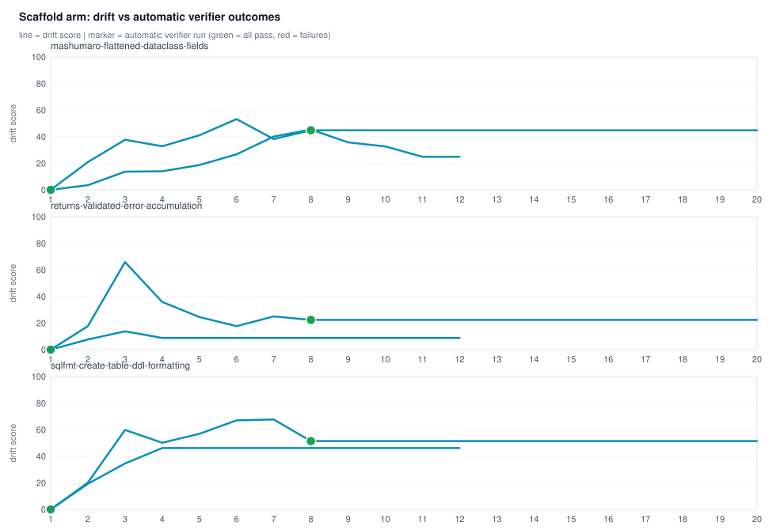
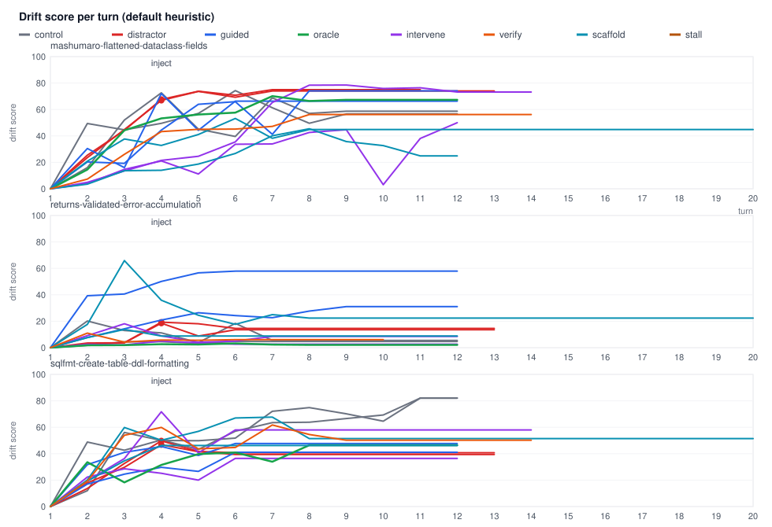
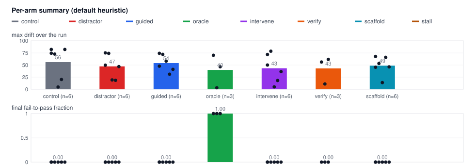
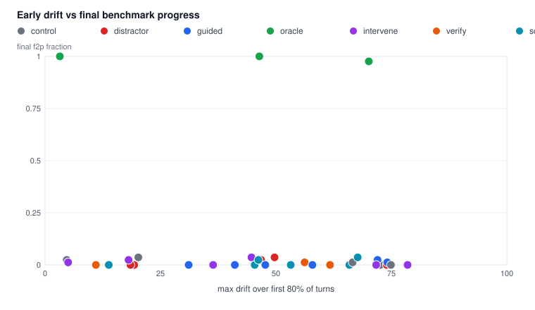
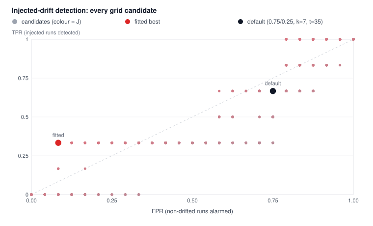
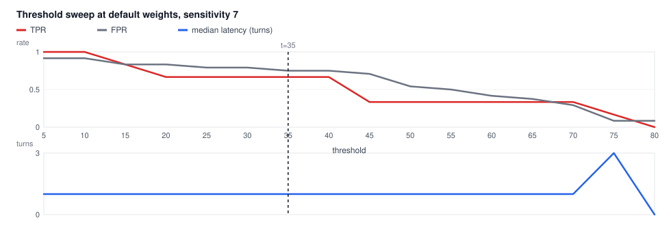
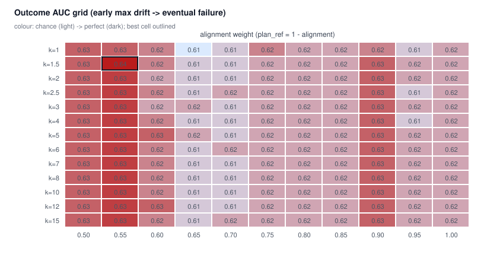
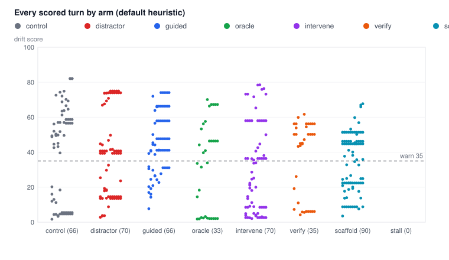

# DeepSWE drift early-detection experiment

Generated 2026-09-23T09:54:51.373Z · model `deepseek-v4.1-flash` (OpenCode inference) · benchmark `datacurve/deep-swe`

## Protocol

Each run works a real DeepSWE task in a local checkout of the pinned repository
with a four-tool agent loop (bash/read/write/edit). After every assistant turn
the session state (PLAN + RECENT ACTIVITY) is probed with the plugin's Laya
questions and compared to the calibration baseline with Jensen-Shannon
divergence — the same code path the opencode plugin uses. A session with no
activity at calibration anchors on its first substantive turn (that turn scores
0, plugin behavior for fresh sessions); turn vectors are logged so every run can
be re-scored under any weight/sensitivity. Final workspaces are graded by the
benchmark's own `grader.py` against the held-out tests.

- runs: 36 across 3 task(s)
- arms: control (task prompt only), distractor (an off-plan request injected
  after turn 3), guided (reference outline in the prompt) and
  oracle (full reference patch in the prompt); drift onset is known for the distractor arm
- outcome label: `reward` / fail-to-pass fraction from the benchmark grader

## Scaffold: verifier in the loop

The `scaffold` arm removes the agent's choice about verification: after any
turn where files changed (or once after a fallback turn, if it never edits), the
harness runs the repository's own test suite and feeds the output back as a
user message. The held-out tests are never used as feedback.

- automatic verifier runs: 6 across 6 run(s)
- runs that changed files or ran tests again after a failing verifier: 0/6
- rewards: 0, 0, 0, 0, 0, 0

| run | automatic verifications | first green | last passed/failed | acted after failure | reward |
| --- | --- | --- | --- | --- | --- |
| mashumaro-flattened-dataclass-fields__scaffold__r1 | 1 | 1 | 29884/0 | no | 0 |
| mashumaro-flattened-dataclass-fields__scaffold__r2 | 1 | 8 | 29884/0 | no | 0 |
| returns-validated-error-accumulation__scaffold__r1 | 1 | 1 | 61/0 | no | 0 |
| returns-validated-error-accumulation__scaffold__r2 | 1 | 8 | 61/0 | no | 0 |
| sqlfmt-create-table-ddl-formatting__scaffold__r1 | 1 | 1 | 1226/0 | no | 0 |
| sqlfmt-create-table-ddl-formatting__scaffold__r2 | 1 | 8 | 1226/0 | no | 0 |

## Closed-loop interventions

Two intervention policies:

- **intervene (v1, score-triggered)** — fires when the drift score crosses a
  threshold and sends a generic self-correction message; recovery here means the
  score fell back below the warn threshold within three turns.
- **verify (v2, evidence-triggered)** — two-stage: (a) files edited but no tests
  after N turns → "run the verifier"; (b) no edits and no tests after N+2 turns →
  "state the next objective step, then do it". Recovery target is objective
  satisfaction: tests executed after the nudge, first green test, final reward.

- v1 interventions: 4, score-recovered: 0/4
- v2 nudges: 5 across 3 run(s); runs that ran tests after the nudge: 0/3
- mean reward (both intervention arms): 0.00 (control arm: 0.00)

| run | arm | trigger | interventions | score recovered | verified after nudge | first green turn | reward |
| --- | --- | --- | --- | --- | --- | --- | --- |
| mashumaro-flattened-dataclass-fields__intervene__r1 | intervene | - | 0 | 0/0 | - | - | 0 |
| mashumaro-flattened-dataclass-fields__intervene__r2 | intervene | 35 | 2 | 0/2 | no | - | 0 |
| mashumaro-flattened-dataclass-fields__verify__r1 | verify | 4 | 2 | 0/2 | no | - | 0 |
| returns-validated-error-accumulation__intervene__r1 | intervene | - | 0 | 0/0 | - | - | 0 |
| returns-validated-error-accumulation__intervene__r2 | intervene | 35 | 0 | 0/0 | - | - | 0 |
| returns-validated-error-accumulation__verify__r1 | verify | 4 | 1 | 1/1 | no | - | 0 |
| sqlfmt-create-table-ddl-formatting__intervene__r1 | intervene | - | 0 | 0/0 | - | - | 0 |
| sqlfmt-create-table-ddl-formatting__intervene__r2 | intervene | 35 | 2 | 0/2 | no | - | 0 |
| sqlfmt-create-table-ddl-formatting__verify__r1 | verify | 4 | 2 | 0/2 | no | - | 0 |

## Per-arm summary (default heuristic: weights {"alignment":0.75,"plan_ref":0.25}, sensitivity 7, threshold 35)

| arm | runs | mean reward | mean f2p | mean max drift | mean final drift |
| --- | --- | --- | --- | --- | --- |
| control | 6 | 0.00 | 0.000 | 56.0 | 48.3 |
| distractor | 6 | 0.00 | 0.000 | 47.2 | 42.9 |
| guided | 6 | 0.00 | 0.000 | 54.0 | 53.0 |
| intervene | 6 | 0.00 | 0.000 | 43.3 | 38.1 |
| oracle | 3 | 1.00 | 1.000 | 39.9 | 38.6 |
| scaffold | 6 | 0.00 | 0.000 | 48.7 | 33.1 |
| verify | 3 | 0.00 | 0.000 | 43.0 | 37.5 |

## Runs (default heuristic: weights {"alignment":0.75,"plan_ref":0.25}, sensitivity 7, threshold 35)

| run | task | arm | turns | reward | f2p | max score | crossing turn | latency | lead |
| --- | --- | --- | --- | --- | --- | --- | --- | --- | --- |
| mashumaro-flattened-dataclass-fields__control__r1 | mashumaro-flattened-dataclass-fields | control | 12 | 0 | 0/66 | 74.3 | 1 | - | 10 |
| mashumaro-flattened-dataclass-fields__control__r2 | mashumaro-flattened-dataclass-fields | control | 12 | 0 | 0/66 | 72.6 | 2 | - | 9 |
| mashumaro-flattened-dataclass-fields__distractor__r1 | mashumaro-flattened-dataclass-fields | distractor | 11 | 0 | 0/66 | 75.0 | 4 | 1 | 8 |
| mashumaro-flattened-dataclass-fields__distractor__r2 | mashumaro-flattened-dataclass-fields | distractor | 13 | 0 | 0/66 | 74.0 | 4 | 1 | 10 |
| mashumaro-flattened-dataclass-fields__guided__r1 | mashumaro-flattened-dataclass-fields | guided | 12 | 0 | 0/66 | 74.1 | 3 | - | 8 |
| mashumaro-flattened-dataclass-fields__guided__r2 | mashumaro-flattened-dataclass-fields | guided | 12 | 0 | 0/66 | 72.0 | 3 | - | 8 |
| mashumaro-flattened-dataclass-fields__intervene__r1 | mashumaro-flattened-dataclass-fields | intervene | 12 | 0 | 0/66 | 50.0 | 7 | - | 4 |
| mashumaro-flattened-dataclass-fields__intervene__r2 | mashumaro-flattened-dataclass-fields | intervene | 14 | 0 | 0/66 | 78.5 | 5 | - | 8 |
| mashumaro-flattened-dataclass-fields__oracle__r1 | mashumaro-flattened-dataclass-fields | oracle | 12 | 1 | 66/66 | 70.1 | 2 | - | 9 |
| mashumaro-flattened-dataclass-fields__scaffold__r1 | mashumaro-flattened-dataclass-fields | scaffold | 12 | 0 | 0/66 | 45.4 | 6 | - | 5 |
| mashumaro-flattened-dataclass-fields__scaffold__r2 | mashumaro-flattened-dataclass-fields | scaffold | 20 | 0 | 0/66 | 53.2 | 2 | - | 17 |
| mashumaro-flattened-dataclass-fields__verify__r1 | mashumaro-flattened-dataclass-fields | verify | 14 | 0 | 0/66 | 56.2 | 3 | - | 10 |
| returns-validated-error-accumulation__control__r1 | returns-validated-error-accumulation | control | 12 | 0 | 0/159 | 4.7 | none | - | - |
| returns-validated-error-accumulation__control__r2 | returns-validated-error-accumulation | control | 12 | 0 | 0/159 | 20.2 | none | - | - |
| returns-validated-error-accumulation__distractor__r1 | returns-validated-error-accumulation | distractor | 13 | 0 | 0/159 | 19.3 | none | - | - |
| returns-validated-error-accumulation__distractor__r2 | returns-validated-error-accumulation | distractor | 13 | 0 | 0/159 | 18.5 | none | - | - |
| returns-validated-error-accumulation__guided__r1 | returns-validated-error-accumulation | guided | 12 | 0 | 0/159 | 57.9 | 1 | - | 10 |
| returns-validated-error-accumulation__guided__r2 | returns-validated-error-accumulation | guided | 12 | 0 | 0/159 | 31.1 | none | - | - |
| returns-validated-error-accumulation__intervene__r1 | returns-validated-error-accumulation | intervene | 12 | 0 | 0/159 | 5.0 | none | - | - |
| returns-validated-error-accumulation__intervene__r2 | returns-validated-error-accumulation | intervene | 12 | 0 | 0/159 | 18.1 | none | - | - |
| returns-validated-error-accumulation__oracle__r1 | returns-validated-error-accumulation | oracle | 12 | 1 | 159/159 | 3.2 | none | - | - |
| returns-validated-error-accumulation__scaffold__r1 | returns-validated-error-accumulation | scaffold | 12 | 0 | 0/159 | 13.8 | none | - | - |
| returns-validated-error-accumulation__scaffold__r2 | returns-validated-error-accumulation | scaffold | 20 | 0 | 0/159 | 65.9 | 2 | - | 17 |
| returns-validated-error-accumulation__verify__r1 | returns-validated-error-accumulation | verify | 10 | 0 | 0/159 | 11.0 | none | - | - |
| sqlfmt-create-table-ddl-formatting__control__r1 | sqlfmt-create-table-ddl-formatting | control | 12 | 0 | 0/32 | 82.1 | 2 | - | 9 |
| sqlfmt-create-table-ddl-formatting__control__r2 | sqlfmt-create-table-ddl-formatting | control | 12 | 0 | 0/32 | 82.1 | 1 | - | 10 |
| sqlfmt-create-table-ddl-formatting__distractor__r1 | sqlfmt-create-table-ddl-formatting | distractor | 13 | 0 | 0/32 | 46.8 | 4 | 1 | 9 |
| sqlfmt-create-table-ddl-formatting__distractor__r2 | sqlfmt-create-table-ddl-formatting | distractor | 13 | 0 | 0/32 | 49.7 | 4 | 1 | 9 |
| sqlfmt-create-table-ddl-formatting__guided__r1 | sqlfmt-create-table-ddl-formatting | guided | 12 | 0 | 0/32 | 41.1 | 5 | - | 6 |
| sqlfmt-create-table-ddl-formatting__guided__r2 | sqlfmt-create-table-ddl-formatting | guided | 12 | 0 | 0/32 | 47.7 | 2 | - | 9 |
| sqlfmt-create-table-ddl-formatting__intervene__r1 | sqlfmt-create-table-ddl-formatting | intervene | 12 | 0 | 0/32 | 36.4 | 5 | - | 6 |
| sqlfmt-create-table-ddl-formatting__intervene__r2 | sqlfmt-create-table-ddl-formatting | intervene | 14 | 0 | 0/32 | 71.7 | 2 | - | 11 |
| sqlfmt-create-table-ddl-formatting__oracle__r1 | sqlfmt-create-table-ddl-formatting | oracle | 12 | 1 | 32/32 | 46.4 | 4 | - | 7 |
| sqlfmt-create-table-ddl-formatting__scaffold__r1 | sqlfmt-create-table-ddl-formatting | scaffold | 12 | 0 | 0/32 | 46.2 | 3 | - | 8 |
| sqlfmt-create-table-ddl-formatting__scaffold__r2 | sqlfmt-create-table-ddl-formatting | scaffold | 20 | 0 | 0/32 | 67.7 | 2 | - | 17 |
| sqlfmt-create-table-ddl-formatting__verify__r1 | sqlfmt-create-table-ddl-formatting | verify | 14 | 0 | 0/32 | 61.7 | 2 | - | 11 |

## Early detection

Default heuristic (`drift.json` today):

- distractor runs: 6, detected: 4 (TPR 0.67)
- non-distractor runs (control/guided/oracle; intervene excluded, its alarms are intentional): 24, false alarms: 18 (FPR 0.75)
- median detection latency: 1.0 turns after injection
- outcome AUC (max score over first 80% of turns → eventual failure): 0.62 (33 failing / 3 succeeding)
- Spearman(early max drift, final fail-to-pass fraction): -0.11 across 36 runs (positive = early drift goes with a worse final score)

Fitted heuristic (grid search: alignment weight 0.50–1.00 step 0.05, sensitivity 1–15, threshold 5–80;
objective: Youden J = TPR − FPR, tie-break on median latency):

- weights {"alignment":0.65,"plan_ref":0.35}, sensitivity 2, threshold 35
- detected: 2/6 (TPR 0.33), false alarms: 2/24 (FPR 0.08)
- median detection latency: 1.0 turns
- outcome AUC: 0.61 (33 failing / 3 succeeding)
- Spearman(early max drift, final fail-to-pass fraction): -0.11

Parameters fitted for outcome prediction (max early drift over the first
80% of turns as a failure score; failures = reward 0):

- best weights {"alignment":0.55,"plan_ref":0.45}, sensitivity 1.5 → outcome AUC 0.64

| rank | alignment | plan_ref | sensitivity | outcome AUC | failures | successes |
| --- | --- | --- | --- | --- | --- | --- |
| 1 | 0.55 | 0.45 | 1.5 | 0.64 | 33 | 3 |
| 2 | 0.55 | 0.45 | 2 | 0.63 | 33 | 3 |
| 3 | 0.55 | 0.45 | 2.5 | 0.63 | 33 | 3 |
| 4 | 0.55 | 0.45 | 3 | 0.63 | 33 | 3 |
| 5 | 0.55 | 0.45 | 4 | 0.63 | 33 | 3 |

Natural failures (control arm, reward 0): lead time of the first default-threshold
crossing before the final turn: 10, 9, 9, 10.

Top injection-detection grid candidates:

| rank | alignment | plan_ref | sensitivity | threshold | TPR | FPR | J | median latency |
| --- | --- | --- | --- | --- | --- | --- | --- | --- |
| 1 | 0.65 | 0.35 | 2 | 35 | 0.33 | 0.08 | 0.25 | 1.0 |
| 2 | 0.5 | 0.5 | 2 | 40 | 0.33 | 0.08 | 0.25 | 1.0 |
| 3 | 0.55 | 0.45 | 2.5 | 45 | 0.33 | 0.08 | 0.25 | 1.0 |
| 4 | 0.6 | 0.4 | 3 | 50 | 0.33 | 0.08 | 0.25 | 1.0 |
| 5 | 0.6 | 0.4 | 4 | 60 | 0.33 | 0.08 | 0.25 | 1.0 |
| 6 | 0.55 | 0.45 | 5 | 70 | 0.33 | 0.08 | 0.25 | 1.0 |
| 7 | 0.6 | 0.4 | 6 | 75 | 0.33 | 0.08 | 0.25 | 1.0 |
| 8 | 0.6 | 0.4 | 7 | 80 | 0.33 | 0.08 | 0.25 | 1.0 |
| 9 | 0.5 | 0.5 | 4 | 65 | 0.33 | 0.08 | 0.25 | 2.5 |
| 10 | 0.65 | 0.35 | 1 | 20 | 0.33 | 0.08 | 0.25 | 3.0 |

## Trajectories (default heuristic)

- `mashumaro-flattened-dataclass-fields__control__r1` ▁▄▄▄▅▆▅▄▅▅▅▅ (0 → 49 → 45 → 50 → 57 → 74 → 61 → 50 → 57 → 57 → 57 → 57)
- `mashumaro-flattened-dataclass-fields__control__r2` ▁▂▅▆▄▄▆▅▅▅▅▅ (0 → 16 → 52 → 73 → 45 → 40 → 69 → 57 → 59 → 59 → 59 → 59)
- `mashumaro-flattened-dataclass-fields__distractor__r1` inject@3 ▁▃▄▆▆▆▇▇▇▇▇ (0 → 25 → 44 → 68 → 74 → 71 → 75 → 75 → 75 → 75 → 75)
- `mashumaro-flattened-dataclass-fields__distractor__r2` inject@3 ▁▂▄▆▆▆▆▆▆▆▆▆▆ (0 → 24 → 45 → 67 → 74 → 69 → 74 → 74 → 74 → 74 → 74 → 74 → 74)
- `mashumaro-flattened-dataclass-fields__guided__r1` ▁▂▂▄▆▆▄▆▆▆▆▆ (0 → 20 → 19 → 44 → 64 → 66 → 41 → 74 → 74 → 74 → 74 → 74)
- `mashumaro-flattened-dataclass-fields__guided__r2` ▁▃▂▆▄▆▆▆▆▆▆▆ (0 → 31 → 16 → 72 → 44 → 66 → 66 → 66 → 66 → 66 → 66 → 66)
- `mashumaro-flattened-dataclass-fields__intervene__r1` ▁▁▂▂▁▃▃▄▄▁▄▅ (0 → 4 → 15 → 21 → 11 → 34 → 34 → 43 → 45 → 3 → 38 → 50)
- `mashumaro-flattened-dataclass-fields__intervene__r2` ▁▁▂▂▂▃▆▇▇▇▇▆▆▆ (0 → 5 → 14 → 22 → 25 → 36 → 65 → 78 → 79 → 76 → 76 → 73 → 73 → 73)
- `mashumaro-flattened-dataclass-fields__oracle__r1` ▁▂▄▅▅▅▆▆▆▆▆▆ (0 → 15 → 44 → 53 → 56 → 58 → 70 → 66 → 67 → 67 → 67 → 67)
- `mashumaro-flattened-dataclass-fields__scaffold__r1` ▁▁▂▂▂▃▄▄▃▃▂▂ (0 → 4 → 14 → 14 → 19 → 27 → 40 → 45 → 36 → 33 → 25 → 25)
- `mashumaro-flattened-dataclass-fields__scaffold__r2` ▁▂▄▃▄▅▄▄▄▄▄▄▄▄▄▄▄▄▄▄ (0 → 21 → 38 → 33 → 41 → 53 → 38 → 45 → 45 → 45 → 45 → 45 → 45 → 45 → 45 → 45 → 45 → 45 → 45 → 45)
- `mashumaro-flattened-dataclass-fields__verify__r1` ▁▁▃▄▄▄▄▅▅▅▅▅▅▅ (0 → 7 → 26 → 43 → 45 → 45 → 47 → 56 → 56 → 56 → 56 → 56 → 56 → 56)
- `returns-validated-error-accumulation__control__r1` ▁▁▁▁▁▁▁▁▁▁▁▁ (0 → 2 → 4 → 5 → 3 → 5 → 5 → 5 → 5 → 5 → 5 → 5)
- `returns-validated-error-accumulation__control__r2` ▁▂▂▁▁▂▁▁▁▁▁▁ (0 → 20 → 13 → 11 → 4 → 18 → 6 → 6 → 6 → 6 → 6 → 6)
- `returns-validated-error-accumulation__distractor__r1` inject@3 ▁▁▁▂▂▂▂▂▂▂▂▂▂ (0 → 3 → 4 → 19 → 18 → 15 → 15 → 15 → 15 → 15 → 15 → 15 → 15)
- `returns-validated-error-accumulation__distractor__r2` inject@3 ▁▁▁▂▁▂▂▂▂▂▂▂▂ (0 → 4 → 4 → 19 → 9 → 14 → 14 → 14 → 14 → 14 → 14 → 14 → 14)
- `returns-validated-error-accumulation__guided__r1` ▁▄▄▅▅▅▅▅▅▅▅▅ (0 → 39 → 41 → 50 → 57 → 58 → 58 → 58 → 58 → 58 → 58 → 58)
- `returns-validated-error-accumulation__guided__r2` ▁▁▂▂▃▂▂▃▃▃▃▃ (0 → 8 → 14 → 21 → 26 → 24 → 23 → 28 → 31 → 31 → 31 → 31)
- `returns-validated-error-accumulation__intervene__r1` ▁▁▁▁▁▁▁▁▁▁▁▁ (0 → 3 → 2 → 5 → 4 → 3 → 3 → 3 → 3 → 3 → 3 → 3)
- `returns-validated-error-accumulation__intervene__r2` ▁▁▂▁▁▁▁▁▁▁▁▁ (0 → 9 → 18 → 9 → 4 → 5 → 9 → 9 → 9 → 9 → 9 → 9)
- `returns-validated-error-accumulation__oracle__r1` ▁▁▁▁▁▁▁▁▁▁▁▁ (0 → 2 → 2 → 3 → 2 → 3 → 2 → 2 → 2 → 2 → 2 → 2)
- `returns-validated-error-accumulation__scaffold__r1` ▁▁▂▁▁▁▁▁▁▁▁▁ (0 → 8 → 14 → 9 → 9 → 9 → 9 → 9 → 9 → 9 → 9 → 9)
- `returns-validated-error-accumulation__scaffold__r2` ▁▂▆▃▂▂▃▂▂▂▂▂▂▂▂▂▂▂▂▂ (0 → 18 → 66 → 36 → 25 → 18 → 25 → 22 → 22 → 22 → 22 → 22 → 22 → 22 → 22 → 22 → 22 → 22 → 22 → 22)
- `returns-validated-error-accumulation__verify__r1` ▁▁▁▁▁▁▁▁▁▁ (0 → 11 → 4 → 6 → 6 → 6 → 6 → 6 → 6 → 6)
- `sqlfmt-create-table-ddl-formatting__control__r1` ▁▁▅▅▄▅▆▆▆▆▇▇ (0 → 12 → 56 → 50 → 50 → 52 → 72 → 75 → 70 → 65 → 82 → 82)
- `sqlfmt-create-table-ddl-formatting__control__r2` ▁▄▄▅▄▅▆▆▆▆▇▇ (0 → 49 → 43 → 50 → 43 → 57 → 64 → 64 → 67 → 69 → 82 → 82)
- `sqlfmt-create-table-ddl-formatting__distractor__r1` inject@3 ▁▂▃▄▄▄▄▄▄▄▄▄▄ (0 → 18 → 30 → 47 → 42 → 39 → 39 → 39 → 39 → 39 → 39 → 39 → 39)
- `sqlfmt-create-table-ddl-formatting__distractor__r2` inject@3 ▁▂▃▄▄▄▄▄▄▄▄▄▄ (0 → 14 → 33 → 50 → 42 → 41 → 41 → 41 → 41 → 41 → 41 → 41 → 41)
- `sqlfmt-create-table-ddl-formatting__guided__r1` ▁▂▂▃▃▄▄▄▄▄▄▄ (0 → 17 → 25 → 30 → 27 → 41 → 41 → 41 → 41 → 41 → 41 → 41)
- `sqlfmt-create-table-ddl-formatting__guided__r2` ▁▃▄▄▄▄▄▄▄▄▄▄ (0 → 32 → 41 → 45 → 39 → 48 → 48 → 48 → 48 → 48 → 48 → 48)
- `sqlfmt-create-table-ddl-formatting__intervene__r1` ▁▂▃▃▂▃▃▃▃▃▃▃ (0 → 22 → 29 → 25 → 20 → 36 → 36 → 36 → 36 → 36 → 36 → 36)
- `sqlfmt-create-table-ddl-formatting__intervene__r2` ▁▂▃▆▄▅▅▅▅▅▅▅▅▅ (0 → 20 → 36 → 72 → 41 → 58 → 58 → 58 → 58 → 58 → 58 → 58 → 58 → 58)
- `sqlfmt-create-table-ddl-formatting__oracle__r1` ▁▃▂▃▄▄▃▄▄▄▄▄ (0 → 34 → 18 → 32 → 40 → 41 → 34 → 46 → 46 → 46 → 46 → 46)
- `sqlfmt-create-table-ddl-formatting__scaffold__r1` ▁▂▃▄▄▄▄▄▄▄▄▄ (0 → 19 → 35 → 46 → 46 → 46 → 46 → 46 → 46 → 46 → 46 → 46)
- `sqlfmt-create-table-ddl-formatting__scaffold__r2` ▁▂▅▅▅▆▆▅▅▅▅▅▅▅▅▅▅▅▅▅ (0 → 20 → 60 → 50 → 57 → 67 → 68 → 51 → 51 → 51 → 51 → 51 → 51 → 51 → 51 → 51 → 51 → 51 → 51 → 51)
- `sqlfmt-create-table-ddl-formatting__verify__r1` ▁▂▅▅▄▄▅▅▅▅▅▅▅▅ (0 → 19 → 54 → 60 → 44 → 45 → 62 → 55 → 50 → 50 → 50 → 50 → 50 → 50)

## Limits

- Small sample: these numbers are a pilot signal, not a benchmark claim. Detection
  latency is measured against a synthetic off-plan injection for positives; the
  natural-failure column is the honest part and needs more runs.
- Runs execute in a local clone with a local Python environment instead of the
  benchmark's Docker image, so absolute pass rates are not comparable to the
  DeepSWE leaderboard. The grader, tests and repositories are the benchmark's own.
- Laya is a heuristic probe: absolute scores are relative signals, and the fitted
  parameters are only as stable as this sample.

## Plots

### trajectories

### arm summary

### early vs outcome

### detection tradeoff

### threshold sweep

### outcome auc grid

### score distribution

### scaffold objective vs drift

